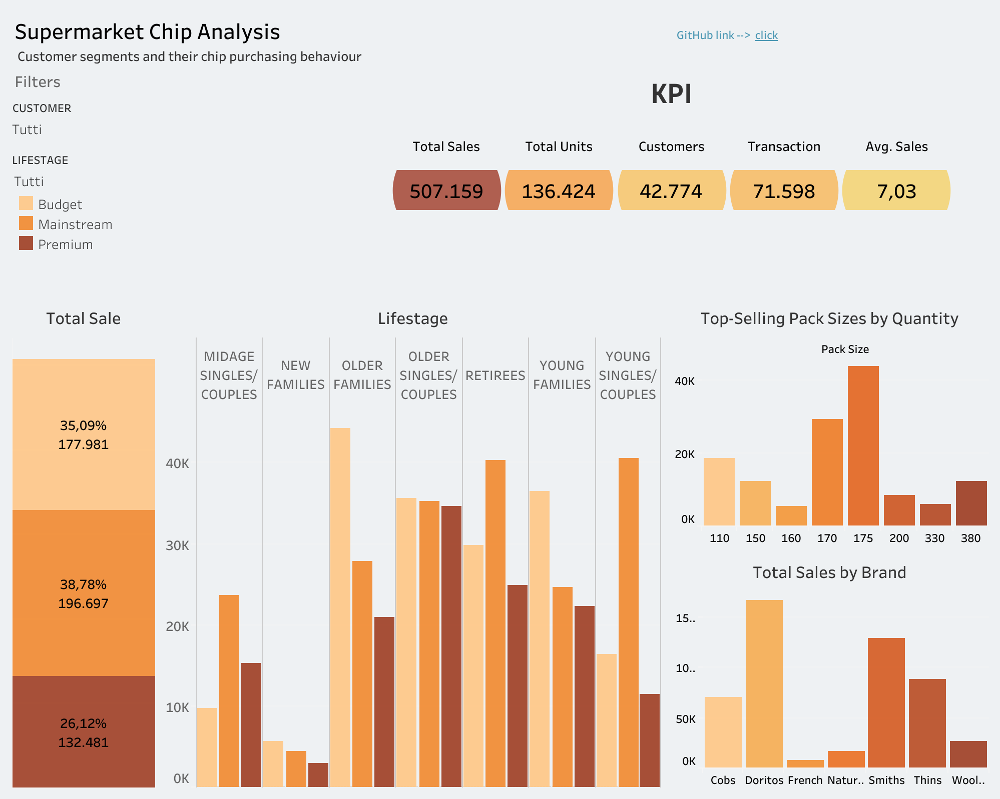

##  Insights and Conclusions

###  1. Customer Segmentation by Sales

- The **"Mainstream" customer segment** accounts for the **largest share of chip sales**, contributing to **38.78%** of total sales.
- Followed by **"Budget"** customers at 35.09% and **"Premium"** customers at 26.12%.

---

###  2. Key Segments Within Mainstream

- Within the **Mainstream** segment, the groups that contribute the most to sales are:
  - **Young Singles/Couples**
  - **Retirees**
- These groups show strong interest in chip consumption, with high purchase volumes.

---

### . High-Value Premium Segments

- In the **Premium** segment, the dominant group is **Older Singles/Couples**.
- Although their volume is lower than mainstream customers, **premium shoppers tend to have a higher average spend per transaction**, suggesting a focus on quality and branded products.

---

### 4. Purchase Behavior and Average Spend

- **Midage Singles/Couples** and **Young Singles/Couples** (especially Mainstream) show a **higher average spend per transaction**.
- This may indicate **impulse-driven purchases** or more frequent consumption patterns.

---

### 5. Pack Size Preferences

- **175g packs** are by far the most purchased across all segments, indicating a strong preference for **mid-sized formats**, ideal for personal or small group consumption.

---

###  6. Top Performing Brands

- The best-selling brand is **Doritos**, followed by **Smiths** and **Thins**.
- Doritos is especially popular among both **Mainstream and Premium** customers and should be leveraged for marketing campaigns.

---

##  Strategic Recommendations

1. **Focus on the Mainstream segment**, especially:
   - Young Singles/Couples  
   - Retirees  
   Use targeted promotions and improve shelf visibility.

2. **Expand premium offerings** for Older Singles/Couples and families, emphasizing quality and premium branding.

3. **Leverage the popular 175g pack size** with promotional bundles and value offers.

4. **Boost visibility of Doritos and Smiths** through seasonal marketing and premium shelf positioning.

---

## Dashboard Access

[📊 Click here to view the interactive dashboard on Tableau Public](#) <!-- https://public.tableau.com/authoring/SupermarketChipAnalysis/Dashboard12#1-->

