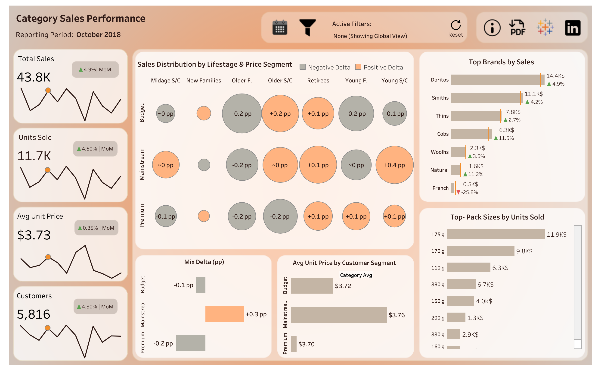

# Strategic Customer Segmentation & Sales Performance Analysis

## Project Overview
This project covers the full analytical workflow — from raw 
transaction data to an executive Tableau dashboard — for the 
Australian Snack & Chips category. It combines **Python data 
engineering** with a **Tableau Executive Dashboard** to help 
Superstore Managers identify high-value customer segments and 
optimize retail strategies.

## Technical Stack
- **Python:** Pandas, NumPy
- **Visualization:** Tableau Desktop Public Edition
- **Techniques:** LOD Expressions (FIXED/EXCLUDE), 
  Table Calculations, Dynamic Parameters, Custom Color Palettes

## Data Pipeline (Python)
The analysis started with a deep-dive into transaction data (2018–2019).
- **Data Cleaning:** Standardized brand names (e.g., 'RRD' → 'Red Rock 
  Deli', 'Snbts' → 'Sunbites') and filtered for chip products only.
- **Outlier Detection:** Removed abnormal transactions (e.g., single 
  customers purchasing 200+ packs) to ensure data integrity.
- **Feature Engineering:** Extracted Pack Size and Brand from product 
  names using Regular Expressions.
- **Segmentation:** Grouped customers by Lifestage and Premium Status 
  to calculate unit averages and sales share.

## Tableau Dashboard Highlights
The dashboard translates raw data into clear business insights:
- **Mix Delta Analysis:** A custom metric highlighting where sales 
  share exceeds volume share — identifying premium-leaning segments.
- **Lifestage Correlations:** Correlating customer lifestages with 
  price sensitivity across Budget, Mainstream, and Premium tiers.
- **Interactivity:** Dynamic filters, MoM benchmarking, and a 
  contextual info panel.

## Repository Structure
- `/notebooks`: Full Python cleaning and analysis (`code.ipynb`)
- `/data`: Cleaned dataset (simulated)
- `/images`: Dashboard exports
- `README.md`: Project summary

## How to Use
1. Explore the [Python Notebook](notebooks/code.ipynb) for the 
   data transformation process
2. Visit the [Live Dashboard on Tableau Public](https://public.tableau.com/app/profile/mykyta.loiko/viz/Reserve_17735943003130/Dashboard_1) 
   for the interactive experience

---
**Author:** Mykyta Loiko | 
[LinkedIn](https://www.linkedin.com/in/mykyta-loiko-9a9ab813a/) | 
[Tableau Public](https://public.tableau.com/app/profile/mykyta.loiko)

